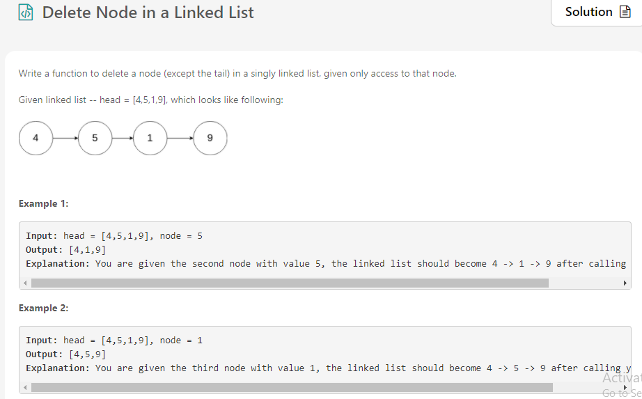
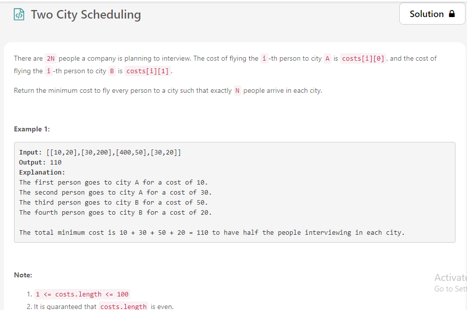
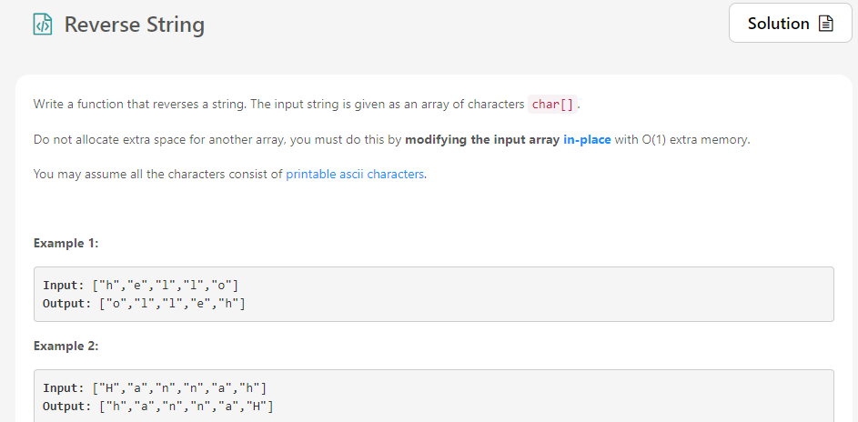
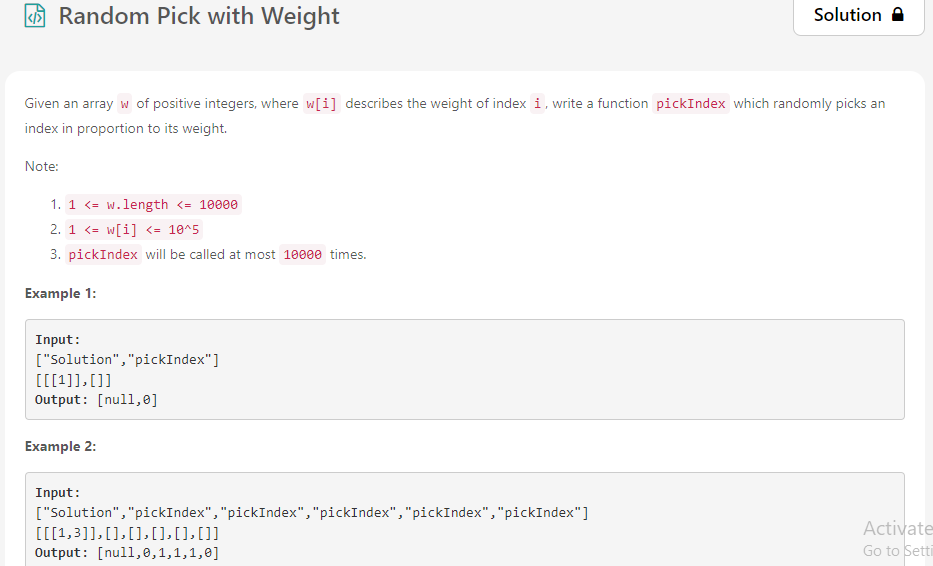

# June-LeetCode-Challenge.
My june leetcode code

                                                                 June 1
                                                                 
                                                                 

                                                                 June 2
                                                                   
                                                                   

First we need to check if the node which is to be deleted is the last node. if it is last node than we can simple assign it null.

If it is a node in middle than we can assign the value of next node to this node. After that we can set the next of this node to next of next node

                                                                 June 3
                                                                 

                                                                 June 4
                                                                 
                                                                 
                                                    
                                                                                       
                                                                 June 5
                                                                                                                            
                   

## Explanation of Input Syntax:

The input is two lists: the subroutines called and their arguments. Solution's constructor has one argument, the array w. pickIndex has no arguments. Arguments are always wrapped with a list, even if there aren't any.

                                                   
                                                    
